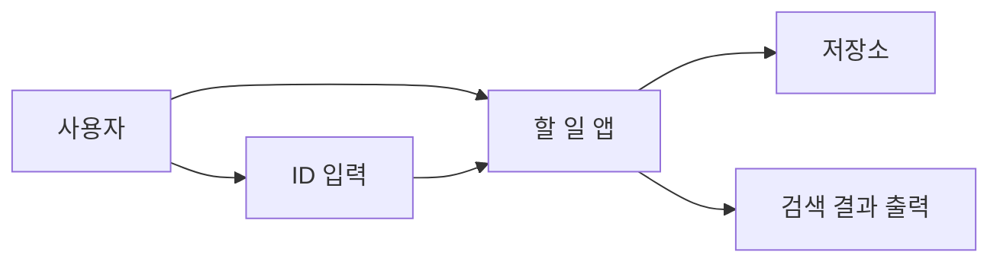

# 파일명: 과제08_스마트할일앱.md

# 📝 [과제 08] 스마트 할 일(To-Do) 앱 만들기
## 주제: `ArrayList` vs `HashMap`, 검색 속도, 자료구조 선택, 평균적 시간 복잡도

**학번:** [본인 학번]  
**이름:** [본인 이름]

---

## 🎯 과제 목표
이 과제에서는 단순히 할 일을 저장하는 앱을 만드는 것이 아니라,

1. 데이터를 **어떤 구조로 저장하느냐에 따라 검색 속도**가 달라진다는 점을 배우고,
2. 순서대로 훑어보는 방식과 키(ID)로 바로 찾는 방식의 차이를 이해하며,
3. AI가 처음 제안한 구조가 정말 적절한지 학생이 직접 검토하는 경험을 합니다.

---

## 📚 이번 과제의 핵심 개념
- `ArrayList`
- `HashMap`
- 고유 ID
- 순차 탐색
- 키-값 저장
- 평균적 시간 복잡도: `O(n)` vs `O(1)`에 가까운 접근
- 중복 ID 문제

---

## 💡 일상 비유로 먼저 이해하기
영어 사전에서 "Apple"을 찾을 때는 보통 알파벳 규칙을 이용해 빠르게 찾습니다.
반면 소설책에서 "Apple"이라는 단어가 나오는 문장을 찾으려면 처음부터 끝까지 훑어야 할 수도 있습니다.

- **소설책처럼 차례대로 찾기** = `ArrayList`를 처음부터 순차 탐색
- **사전처럼 키로 바로 찾기** = `HashMap`에서 ID를 키로 검색

즉, 데이터가 많아질수록 “저장 방식” 자체가 성능을 결정합니다.

---

## 🧩 과제 시나리오
고유한 ID를 가진 할 일 관리 앱을 만든다고 가정합니다.
예를 들어,
- 101 → "자바 과제 제출"
- 102 → "수학 퀴즈 준비"
- 103 → "동아리 회의 참석"

프로그램은 최소한 아래 기능을 가져야 합니다.
- 할 일 추가
- ID로 할 일 검색
- 전체 할 일 출력

선택 기능(도전 과제)
- 할 일 수정
- 완료 여부 표시
- 할 일 삭제

---

## 🧠 이번 과제의 AI 관리 포인트
이 과제에서는 학생이 먼저 결정해야 할 것이 있습니다.

- 이 데이터는 “순서가 중요”한가, “검색 속도”가 중요한가?
- ID는 중복되면 안 되는가?
- 데이터가 10개일 때와 10만 개일 때, 같은 구조를 써도 괜찮은가?

AI는 코드를 빨리 만들 수 있지만, **자료구조를 왜 선택했는지 설명할 책임은 학생에게 있습니다.**

---

## ✅ 최종 제출물
아래 5가지를 반드시 함께 제출하세요.

1. 설계 메모 또는 구조도
2. AI에게 입력한 프롬프트
3. AI가 처음 생성한 코드 초안
4. 직접 수정한 최종 코드
5. 테스트 결과와 짧은 회고

---

# 1단계. 사람의 생각 먼저 하기 (Human Design)

## 1-1. 문제를 내 말로 다시 설명하기
아래 빈칸을 채우세요.

- 이 프로그램이 저장하는 핵심 데이터는 무엇인가?  
  **답:** [예: ID, 할 일 내용]

- 사용자는 어떤 방식의 검색을 원할 가능성이 큰가?  
  **답:** [예: ID를 입력해서 바로 찾기]

- 데이터가 3개일 때와 100,000개일 때, 같은 방식의 검색을 써도 괜찮은가?  
  **답:** [여기에 작성]

---

## 1-2. 자료구조 선택 관점에서 생각하기
다음 질문에 답하세요.

1. `ArrayList`에 저장하면 ID 검색은 어떻게 이루어지는가?
2. `HashMap`에 저장하면 무엇을 키(key)로 써야 하는가?
3. 할 일 ID가 중복되면 어떤 문제가 생길 수 있는가?

### 나의 생각
[여기에 4~6문장 정도로 작성]

---

## 1-3. 구조도 그리기
### 예시 (Mermaid)


### 내가 선택한 저장 구조
- 나는 **[ArrayList / HashMap]** 중심으로 생각하겠다.
- 이유: [여기에 작성]

### 내가 작성한 구조도
```text
[여기에 직접 작성]
```

---

# 2단계. AI에게 초안 시키기 (Prompting)

## 2-1. 좋지 않은 프롬프트 예시
> "자바로 할 일 앱 짜줘."

이 프롬프트는 너무 모호해서,
- ID 검색이 중요한지,
- 어떤 자료구조를 원하는지,
- 성능을 신경 써야 하는지
전혀 전달하지 못합니다.

---

## 2-2. 일부러 비효율적인 초안 받기
이번에는 AI에게 일부러 `ArrayList`만 쓰게 해서 한계를 체험합니다.

> **AI에게 입력할 프롬프트**  
> "너는 나의 코딩 인턴이야. Java 콘솔 프로그램으로 간단한 할 일 관리 앱의 **초안 코드**를 작성해 줘. 각 할 일에는 고유한 ID와 내용이 있어야 해. 특정 ID를 입력하면 해당 할 일을 찾아 출력하는 기능이 필요해. **단, 저장 구조는 무조건 `ArrayList`만 사용해 줘. `HashMap`은 쓰지 마.** 초보자가 읽기 쉽게 주석을 자세히 달아 줘."

---

## 2-3. AI가 처음 생성한 코드 초안
```java
// 여기에 AI가 처음 생성한 코드를 붙여 넣으세요.
```

---

## 2-4. AI에게 반드시 추가로 물어볼 질문
아래 질문 중 3개 이상을 실제로 던지고 답을 기록하세요.

1. 이 코드에서 특정 ID를 찾을 때 몇 개까지 비교할 수 있어?
2. `ArrayList`로도 동작은 하는데, 왜 데이터가 많아지면 느려질 수 있어?
3. `HashMap`으로 바꾸면 무엇이 빨라지고, 무엇이 달라져?
4. ID가 중복되면 어떤 구조가 더 관리하기 쉬워?
5. 전체 목록 출력은 `HashMap`보다 `ArrayList`가 더 편할 수도 있나?

### 질문과 답변 기록
- 질문 1: [작성]  
  답변 요약: [작성]
- 질문 2: [작성]  
  답변 요약: [작성]
- 질문 3: [작성]  
  답변 요약: [작성]

---

# 3단계. 직접 실행하고 의심하기 (Code Review)

## 3-1. 먼저 정상 동작을 확인하기
아래 기본 테스트를 해 보세요.

| 테스트 항목 | 내가 예상한 결과 | 실제 결과 | 통과 여부 |
|---|---|---|---|
| 할 일 3개 추가 | 정상 저장 | [작성] | [O/X] |
| 존재하는 ID 검색 | 해당 할 일 출력 | [작성] | [O/X] |
| 존재하지 않는 ID 검색 | 없음 안내 | [작성] | [O/X] |
| 전체 목록 출력 | 저장된 항목 표시 | [작성] | [O/X] |

---

## 3-2. 성능과 구조를 의심해 보기
아래 테스트 또는 사고 실험을 수행하세요.

| 검토 항목 | 내가 예상한 결과 | 실제 결과 또는 분석 | 통과 여부 |
|---|---|---|---|
| 할 일이 10개일 때 검색 | 큰 차이 없음 | [작성] | [O/X] |
| 할 일이 10,000개일 때 검색 | 순차 탐색 부담 증가 | [작성] | [O/X] |
| 중복 ID 입력 | 충돌 또는 덮어쓰기 문제 검토 | [작성] | [O/X] |
| 여러 번 검색 반복 | `ArrayList`는 매번 처음부터 찾음 | [작성] | [O/X] |

### 여기서 발견한 문제점
[예: ID 검색 시 항상 처음부터 끝까지 탐색함, 중복 ID 관리가 어색함]

---

## 3-3. AI에게 수정 지시하기
아래 템플릿을 참고해 다시 지시하세요.

> **수정 요청 프롬프트 예시 1**  
> "이 앱은 ID로 빨리 찾는 기능이 중요해. 저장 구조를 `HashMap<Integer, String>` 또는 적절한 객체 구조로 바꾸고, ID를 키로 사용해서 평균적으로 더 빠르게 검색할 수 있게 고쳐 줘."

> **수정 요청 프롬프트 예시 2**  
> "ID가 중복되면 안 되니까, 같은 ID가 들어오면 새로 추가하지 말고 경고 메시지를 출력하게 만들어 줘."

> **수정 요청 프롬프트 예시 3**  
> "전체 목록 출력 기능도 유지하되, 검색은 빠르게 되도록 구조를 설명과 함께 다시 설계해 줘."

### 수정 요청 후 받은 핵심 변경점
- 변경점 1: [작성]
- 변경점 2: [작성]
- 변경점 3: [작성]

---

## 3-4. 최종 수정 코드 붙여 넣기
```java
// 여기에 최종 수정한 코드를 붙여 넣으세요.
```

---

# 4단계. 내가 직접 리뷰한 내용 정리하기
아래 질문에 답하세요.

1. 이 프로그램에서 정말 중요한 것은 "저장"인가, "검색"인가?  
   **답:** [작성]

2. `ArrayList` 초안은 왜 작은 데이터에서는 괜찮아 보여도, 큰 데이터에서는 아쉬울 수 있는가?  
   **답:** [작성]

3. `HashMap`을 썼을 때 얻는 장점과 주의할 점은 무엇인가?  
   **답:** [작성]

4. 다음에 자료구조를 선택할 때 AI에게 어떤 질문을 먼저 던질 것인가?  
   **답:** [작성]

---

# 5단계. 제출 체크리스트
- [ ] ID 검색이 왜 핵심인지 설명했다.
- [ ] 설계도 또는 구조 메모를 포함했다.
- [ ] AI에게 입력한 프롬프트를 제출물에 포함했다.
- [ ] `ArrayList` 초안과 개선 후 구조를 비교했다.
- [ ] 중복 ID와 대량 데이터 상황을 검토했다.
- [ ] 자료구조 선택 이유를 내 말로 설명했다.
- [ ] 회고 질문에 답했다.

---

## 🌱 도전 과제 (선택)
아래 중 하나를 추가로 구현해 보세요.
- `ToDo` 클래스를 만들어 ID, 내용, 완료 여부를 묶기
- 할 일 수정 기능 추가하기
- 삭제 기능 추가하기
- 검색 시간을 `System.nanoTime()`으로 비교해 보기

---

## 한 줄 정리
이 과제의 핵심은 "할 일 앱을 만드는 것"이 아니라, **검색이 중요한 문제에서 어떤 자료구조를 선택해야 하는지 스스로 설명하는 것**입니다.
