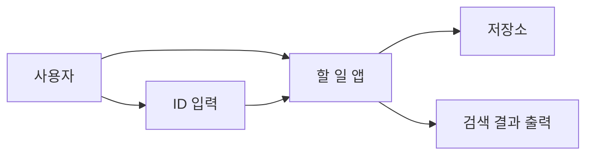
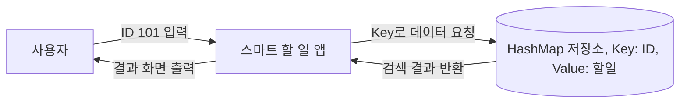

# 과제08_스마트할일앱

# 파일명: 과제08_스마트할일앱.md

# 📝 [과제 08] 스마트 할 일(To-Do) 앱 만들기

## 주제: `ArrayList` vs `HashMap`, 검색 속도, 자료구조 선택, 평균적 시간 복잡도

**학번:** 60251803

**이름:** 김 민 혁

---

## 🎯 과제 목표

이 과제에서는 단순히 할 일을 저장하는 앱을 만드는 것이 아니라,

1. 데이터를 **어떤 구조로 저장하느냐에 따라 검색 속도**가 달라진다는 점을 배우고,
2. 순서대로 훑어보는 방식과 키(ID)로 바로 찾는 방식의 차이를 이해하며,
3. AI가 처음 제안한 구조가 정말 적절한지 학생이 직접 검토하는 경험을 합니다.

---

## 📚 이번 과제의 핵심 개념

- `ArrayList`
- `HashMap`
- 고유 ID
- 순차 탐색
- 키-값 저장
- 평균적 시간 복잡도: `O(n)` vs `O(1)`에 가까운 접근
- 중복 ID 문제

---

## 💡 일상 비유로 먼저 이해하기

영어 사전에서 “Apple”을 찾을 때는 보통 알파벳 규칙을 이용해 빠르게 찾습니다.
반면 소설책에서 “Apple”이라는 단어가 나오는 문장을 찾으려면 처음부터 끝까지 훑어야 할 수도 있습니다.

- **소설책처럼 차례대로 찾기** = `ArrayList`를 처음부터 순차 탐색
- **사전처럼 키로 바로 찾기** = `HashMap`에서 ID를 키로 검색

즉, 데이터가 많아질수록 “저장 방식” 자체가 성능을 결정합니다.

---

## 🧩 과제 시나리오

고유한 ID를 가진 할 일 관리 앱을 만든다고 가정합니다.
예를 들어,
- 101 → “자바 과제 제출”
- 102 → “수학 퀴즈 준비”
- 103 → “동아리 회의 참석”

프로그램은 최소한 아래 기능을 가져야 합니다.
- 할 일 추가
- ID로 할 일 검색
- 전체 할 일 출력

선택 기능(도전 과제)
- 할 일 수정
- 완료 여부 표시
- 할 일 삭제

---

## 🧠 이번 과제의 AI 관리 포인트

이 과제에서는 학생이 먼저 결정해야 할 것이 있습니다.

- 이 데이터는 “순서가 중요”한가, “검색 속도”가 중요한가?
- ID는 중복되면 안 되는가?
- 데이터가 10개일 때와 10만 개일 때, 같은 구조를 써도 괜찮은가?

AI는 코드를 빨리 만들 수 있지만, **자료구조를 왜 선택했는지 설명할 책임은 학생에게 있습니다.**

---

## ✅ 최종 제출물

아래 5가지를 반드시 함께 제출하세요.

1. 설계 메모 또는 구조도
2. AI에게 입력한 프롬프트
3. AI가 처음 생성한 코드 초안
4. 직접 수정한 최종 코드
5. 테스트 결과와 짧은 회고

---

# 1단계. 사람의 생각 먼저 하기 (Human Design)

## 1-1. 문제를 내 말로 다시 설명하기

아래 빈칸을 채우세요.

- 이 프로그램이 저장하는 핵심 데이터는 무엇인가?
    
    **답:** ID, 할 일, 기간, 완료 여부
    
- 사용자는 어떤 방식의 검색을 원할 가능성이 큰가?
    
    **답:** ID를 통한 검색
    
- 데이터가 3개일 때와 100,000개일 때, 같은 방식의 검색을 써도 괜찮은가?
    
    **답:** [여기에 작성]
    

---

## 1-2. 자료구조 선택 관점에서 생각하기

다음 질문에 답하세요.

1. `ArrayList`에 저장하면 ID 검색은 어떻게 이루어지는가?
2. `HashMap`에 저장하면 무엇을 키(key)로 써야 하는가?
3. 할 일 ID가 중복되면 어떤 문제가 생길 수 있는가?

### 나의 생각

ArrayList로 0번 인덱스부터 마지막 인덱스까지 순서대로 돌며 ID로 하나하나 대조하고 찾아봐야 한다. HashMap으로 저장한다면 ID를 key로 사용하고, 도전 과제까지 적용시킨다면 ToDo를 하나의 객체로 만들어 value로 써야 한다. 할 일 ID가 중복된다면 사용자가 ID를 통해 검색 할 때 중복된 ID중 어떤 것이 사용자가 원하는 ID인지 알 수 없다.

---

## 1-3. 구조도 그리기

### 예시 (Mermaid)



### 내가 선택한 저장 구조

- 나는 **HashMap** 중심으로 생각하겠다.
- 이유: ArrayList로 만들면 ID검색을 할 때 마다 많은 시간이 소요돼 비효율적이다.

### 내가 작성한 구조도



---

# 2단계. AI에게 초안 시키기 (Prompting)

## 2-1. 좋지 않은 프롬프트 예시

> “자바로 할 일 앱 짜줘.”
> 

이 프롬프트는 너무 모호해서,
- ID 검색이 중요한지,
- 어떤 자료구조를 원하는지,
- 성능을 신경 써야 하는지
전혀 전달하지 못합니다.

---

## 2-2. 일부러 비효율적인 초안 받기

이번에는 AI에게 일부러 `ArrayList`만 쓰게 해서 한계를 체험합니다.

> **AI에게 입력할 프롬프트**
> 
> 
> “너는 나의 코딩 인턴이야. Java 콘솔 프로그램으로 간단한 할 일 관리 앱의 **초안 코드**를 작성해 줘. 각 할 일에는 고유한 ID와 내용이 있어야 해. 특정 ID를 입력하면 해당 할 일을 찾아 출력하는 기능이 필요해. **단, 저장 구조는 무조건 `ArrayList`만 사용해 줘. `HashMap`은 쓰지 마.** 초보자가 읽기 쉽게 주석을 자세히 달아 줘.”
> 

---

## 2-3. AI가 처음 생성한 코드 초안

```java
import java.util.ArrayList;
import java.util.Scanner;

// 할 일(ToDo) 1개의 정보를 담는 객체입니다.
class ToDo {
    int id; // 고유 ID
    String content; // 할 일 내용

    // 생성자: 새로운 할 일을 만들 때 ID와 내용을 설정해 줍니다.
    public ToDo(int id, String content) {
        this.id = id;
        this.content = content;
    }
}

public class ToDoApp {
    public static void main(String[] args) {
        // 데이터 저장소: 할 일들을 저장할 ArrayList를 만듭니다. (HashMap은 절대 사용하지 않습니다!)
        ArrayList<ToDo> todoList = new ArrayList<>();
        Scanner scanner = new Scanner(System.in);

        // 테스트를 위해 미리 임시 데이터를 몇 개 넣어둡니다.
        todoList.add(new ToDo(101, "자바 과제 제출"));
        todoList.add(new ToDo(102, "수학 퀴즈 준비"));
        todoList.add(new ToDo(103, "동아리 회의 참석"));

        System.out.println("=== 스마트 할 일 관리 앱 (ArrayList 버전) ===");

        while (true) {
            System.out.println("\n1. 할 일 추가  2. ID로 할 일 검색  3. 전체 할 일 보기  4. 종료");
            System.out.print("메뉴를 선택하세요: ");
            
            int choice = scanner.nextInt();
            scanner.nextLine(); // 엔터키 처리

            if (choice == 1) {
                // [할 일 추가 기능]
                System.out.print("새로운 할 일의 고유 ID를 입력하세요 (숫자): ");
                int newId = scanner.nextInt();
                scanner.nextLine(); // 엔터키 처리
                
                System.out.print("할 일 내용을 입력하세요: ");
                String newContent = scanner.nextLine();
                
                // 새로운 ToDo 객체를 만들어서 ArrayList의 맨 끝에 추가합니다.
                todoList.add(new ToDo(newId, newContent));
                System.out.println("-> 할 일이 성공적으로 추가되었습니다!");

            } else if (choice == 2) {
                // [ID로 검색 기능] - ★ 여기가 ArrayList의 한계를 보여주는 핵심 부분입니다!
                System.out.print("\n검색할 할 일의 ID를 입력하세요: ");
                int searchId = scanner.nextInt();
                boolean found = false;

                // ArrayList는 인덱스 번호만 알기 때문에, 0번부터 끝까지 하나씩 전부 열어봐야 합니다. (순차 탐색)
                for (int i = 0; i < todoList.size(); i++) {
                    ToDo currentTask = todoList.get(i);
                    
                    // 내가 찾던 ID와 현재 열어본 할 일의 ID가 일치하는지 비교합니다.
                    if (currentTask.id == searchId) {
                        System.out.println("-> 찾았습니다! 내용: " + currentTask.content);
                        found = true;
                        break; // 찾았으니 더 이상 찾을 필요 없이 반복문을 빠져나옵니다.
                    }
                }

                // 리스트를 처음부터 끝까지 다 뒤졌는데도 못 찾았다면
                if (!found) {
                    System.out.println("-> 일치하는 ID가 없습니다.");
                }

            } else if (choice == 3) {
                // [전체 목록 출력 기능]
                System.out.println("\n[전체 할 일 목록]");
                // ArrayList에 있는 모든 할 일을 처음부터 끝까지 순서대로 꺼내옵니다.
                for (int i = 0; i < todoList.size(); i++) {
                    ToDo t = todoList.get(i);
                    System.out.println("ID: " + t.id + " | 내용: " + t.content);
                }

            } else if (choice == 4) {
                // [종료]
                System.out.println("프로그램을 종료합니다.");
                break;
            } else {
                System.out.println("잘못된 번호입니다. 다시 선택해 주세요.");
            }
        }
        
        scanner.close();
    }
}
```

---

## 2-4. AI에게 반드시 추가로 물어볼 질문

아래 질문 중 3개 이상을 실제로 던지고 답을 기록하세요.

1. 이 코드에서 특정 ID를 찾을 때 몇 개까지 비교할 수 있어?
2. `ArrayList`로도 동작은 하는데, 왜 데이터가 많아지면 느려질 수 있어?
3. `HashMap`으로 바꾸면 무엇이 빨라지고, 무엇이 달라져?
4. ID가 중복되면 어떤 구조가 더 관리하기 쉬워?
5. 전체 목록 출력은 `HashMap`보다 `ArrayList`가 더 편할 수도 있나?

### 질문과 답변 기록

- 질문 1: 이 코드에서 특정 ID를 찾을 때 몇 개까지 비교할 수 있어?
답변 요약: 최악의 경우 저장된 할 일의 전체 개수(N개)만큼 전부 비교해야 해. 데이터가 3개면 최대 3번이지만, 데이터가 10만 개라면 최대 10만 번을 하나하나 비교해야 찾을 수 있어.
- 질문 2: ID가 중복되면 어떤 구조가 더 관리하기 쉬워?
답변 요약: `HashMap`이 훨씬 쉬워. `ArrayList`는 새 ID를 추가할 때 중복인지 확인하려면 매번 리스트 전체를 뒤져야 하지만, `HashMap`은 `containsKey(ID)` 메서드 하나로 즉시(O(1) 속도로) 중복 여부를 확인하고 걸러낼 수 있거든.
- 질문 3: 전체 목록 출력은 `HashMap`보다 `ArrayList`가 더 편할 수도 있나?
답변 요약: 응, 맞아. `ArrayList`는 데이터가 들어온 '순서'를 그대로 유지하기 때문에 처음부터 끝까지 순서대로 나열해 출력하기 편해. 반면 `HashMap`은 순서를 완전히 무시하고 뒤죽박죽으로 저장하기 때문에, 입력한 순서대로 깔끔하게 전체 목록을 출력하기는 어려워.

---

# 3단계. 직접 실행하고 의심하기 (Code Review)

## 3-1. 먼저 정상 동작을 확인하기

아래 기본 테스트를 해 보세요.

| 테스트 항목 | 내가 예상한 결과 | 실제 결과 | 통과 여부 |
| --- | --- | --- | --- |
| 할 일 3개 추가 | 정상 저장 | 정상 저장 | O |
| 존재하는 ID 검색 | 해당 할 일 출력 | 해당 할 일 출력 | O |
| 존재하지 않는 ID 검색 | 없음 안내 | 잘못된 번호힙니다. 다시 선택해 주세요. | O |
| 전체 목록 출력 | 저장된 항목 표시 | 전체 출력 | O |

---

## 3-2. 성능과 구조를 의심해 보기

아래 테스트 또는 사고 실험을 수행하세요.

| 검토 항목 | 내가 예상한 결과 | 실제 결과 또는 분석 | 통과 여부 |
| --- | --- | --- | --- |
| 할 일이 10개일 때 검색 | 큰 차이 없음 | 큰 차이 없음 | O |
| 할 일이 10,000개일 때 검색 | 순차 탐색 부담 증가 | 순차 탐색 부담 증가 | O |
| 중복 ID 입력 | 충돌 또는 덮어쓰기 문제 검토 | 중복처리를 하지 않고 List의가장 뒤에 붙여넣기 때문에 중복 ID를 갖는 할 일 중 먼저 추가된 것을 출력함. | O |
| 여러 번 검색 반복 | `ArrayList`는 매번 처음부터 찾음 | `ArrayList`
는 매번 처음부터 찾음 | O |

### 여기서 발견한 문제점

ID를 처음부터 찾기 떄문에 데이터가 늘어날 수록 속도가 현저히 저하됨. 중ㅂ고된 ID가 들어오면 따로 처리하지 못하고 사실상 무시됨.

---

## 3-3. AI에게 수정 지시하기

아래 템플릿을 참고해 다시 지시하세요.

> **수정 요청 프롬프트 예시 1**
> 
> 
> “이 앱은 ID로 빨리 찾는 기능이 중요해. 저장 구조를 `HashMap<Integer, String>` 또는 적절한 객체 구조로 바꾸고, ID를 키로 사용해서 평균적으로 더 빠르게 검색할 수 있게 고쳐 줘.”
> 

> **수정 요청 프롬프트 예시 2**
> 
> 
> “ID가 중복되면 안 되니까, 같은 ID가 들어오면 새로 추가하지 말고 경고 메시지를 출력하게 만들어 줘.”
> 

> **수정 요청 프롬프트 예시 3**
> 
> 
> “전체 목록 출력 기능도 유지하되, 검색은 빠르게 되도록 구조를 설명과 함께 다시 설계해 줘.”
> 

### 수정 요청 후 받은 핵심 변경점

- 변경점 1: 데이터 저장소를 `ArrayList<ToDo>`에서 `HashMap<Integer, ToDo>`로 변경하여, ID를 키(Key)로 사용해 **평균 O(1)의 속도**로 즉시 검색할 수 있게 개선함.
- 변경점 2: 할 일을 추가할 때 `todoMap.containsKey(newId)` 메서드를 사용해 이미 존재하는 ID인지 확인하는 로직을 추가하여, 기존 데이터가 덮어씌워지는(Overwrite) 문제를 방지함.
- 변경점 3: 전체 목록 출력 기능은 유지하되, `HashMap.values()`를 순회하도록 변경함. (단, HashMap의 특성상 입력된 순서대로 출력되지는 않음)

---

## 3-4. 최종 수정 코드 붙여 넣기

```java
import java.util.HashMap;
import java.util.Scanner;

// 할 일(ToDo) 1개의 정보를 담는 객체입니다.
class ToDo {
    int id; // 고유 ID (HashMap의 Key와 동일한 값을 가짐)
    String content; // 할 일 내용

    public ToDo(int id, String content) {
        this.id = id;
        this.content = content;
    }
}

public class ToDoApp {
    public static void main(String[] args) {
        // [핵심 변경점] 데이터 저장소를 HashMap으로 변경했습니다.
        // 키(Key)는 Integer 형태의 ID, 값(Value)은 ToDo 객체입니다.
        HashMap<Integer, ToDo> todoMap = new HashMap<>();
        Scanner scanner = new Scanner(System.in);

        // 테스트를 위한 초기 데이터
        todoMap.put(101, new ToDo(101, "자바 과제 제출"));
        todoMap.put(102, new ToDo(102, "수학 퀴즈 준비"));
        todoMap.put(103, new ToDo(103, "동아리 회의 참석"));

        System.out.println("=== 스마트 할 일 관리 앱 (HashMap 고속 검색 버전) ===");

        while (true) {
            System.out.println("\n1. 할 일 추가  2. ID로 할 일 검색  3. 전체 할 일 보기  4. 종료");
            System.out.print("메뉴를 선택하세요: ");
            
            int choice = scanner.nextInt();
            scanner.nextLine(); // 엔터키 처리

            if (choice == 1) {
                // [할 일 추가 기능]
                System.out.print("새로운 할 일의 고유 ID를 입력하세요 (숫자): ");
                int newId = scanner.nextInt();
                scanner.nextLine();
                
                // [안전 장치] HashMap은 같은 키를 넣으면 덮어쓰기가 되므로, 미리 중복 검사를 합니다.
                if (todoMap.containsKey(newId)) {
                    System.out.println("-> [경고] 이미 존재하는 ID입니다! 다른 ID를 사용해 주세요.");
                } else {
                    System.out.print("할 일 내용을 입력하세요: ");
                    String newContent = scanner.nextLine();
                    
                    // ID를 키(Key)로 지정하고, ToDo 객체를 값(Value)으로 저장합니다.
                    todoMap.put(newId, new ToDo(newId, newContent));
                    System.out.println("-> 할 일이 성공적으로 추가되었습니다!");
                }

            } else if (choice == 2) {
                // [ID로 검색 기능] - ★ HashMap 덕분에 검색 속도가 획기적으로 빨라졌습니다!
                System.out.print("\n검색할 할 일의 ID를 입력하세요: ");
                int searchId = scanner.nextInt();

                // ArrayList처럼 반복문을 돌릴 필요 없이, get() 메서드로 한 번에 찾아옵니다. (평균 O(1) 속도)
                ToDo foundTask = todoMap.get(searchId);

                // 만약 해당하는 키(ID)가 없다면 null을 반환합니다.
                if (foundTask != null) {
                    System.out.println("-> ⚡ [즉시 검색 완료] 내용: " + foundTask.content);
                } else {
                    System.out.println("-> 일치하는 ID가 없습니다.");
                }

            } else if (choice == 3) {
                // [전체 목록 출력 기능]
                System.out.println("\n[전체 할 일 목록]");
                // HashMap에 저장된 모든 Value(ToDo 객체)들만 쏙쏙 뽑아서 순회합니다.
                // 주의: HashMap은 순서를 보장하지 않으므로, 입력한 순서대로 출력되지 않을 수 있습니다.
                for (ToDo t : todoMap.values()) {
                    System.out.println("ID: " + t.id + " | 내용: " + t.content);
                }

            } else if (choice == 4) {
                System.out.println("프로그램을 종료합니다.");
                break;
            } else {
                System.out.println("잘못된 번호입니다. 다시 선택해 주세요.");
            }
        }
        
        scanner.close();
    }
}
```

---

# 4단계. 내가 직접 리뷰한 내용 정리하기

아래 질문에 답하세요.

1. 이 프로그램에서 정말 중요한 것은 “저장”인가, “검색”인가?
    
    **답:** 검색을 잘, 효율적으로 하는 것이 중요하다.
    
2. `ArrayList` 초안은 왜 작은 데이터에서는 괜찮아 보여도, 큰 데이터에서는 아쉬울 수 있는가?
    
    **답:** 처음부터 끝까지 하나하나 찾아야 하기 때문에 비효율적이고 오래 걸린다.
    
3. `HashMap`을 썼을 때 얻는 장점과 주의할 점은 무엇인가?
    
    **답:** 고유 ID를 통해 위치를 계산하여 즉시 알려주므로, 훨씬 빠르다. 중복 데이터를 처리하기에도 쉽다. 그러나 데이터가 입력된 순서를 기억하지 못하기 때문에, 주의가 필요하다.
    
4. 다음에 자료구조를 선택할 때 AI에게 어떤 질문을 먼저 던질 것인가?
    
    **답:** 내가 구현하기로 생각하고 있는 기능, 필요한 요소들을 알려주고, 이러한 프로그램을 만든다고 했을 때, 내가 생각한 이러한 자료구조들 중 무엇이  가장 효율적일 것 같은지, 그리고 그보다 더 효율적인데 내가 알지 못했던 자료구조가 있는지 먼저 질문할 것 같다.
    

---

# 5단계. 제출 체크리스트

- [x]  ID 검색이 왜 핵심인지 설명했다.
- [x]  설계도 또는 구조 메모를 포함했다.
- [x]  AI에게 입력한 프롬프트를 제출물에 포함했다.
- [x]  `ArrayList` 초안과 개선 후 구조를 비교했다.
- [x]  중복 ID와 대량 데이터 상황을 검토했다.
- [x]  자료구조 선택 이유를 내 말로 설명했다.
- [x]  회고 질문에 답했다.

---

## 🌱 도전 과제 (선택)

아래 중 하나를 추가로 구현해 보세요.
- `ToDo` 클래스를 만들어 ID, 내용, 완료 여부를 묶기
- 할 일 수정 기능 추가하기
- 삭제 기능 추가하기
- 검색 시간을 `System.nanoTime()`으로 비교해 보기

---

## 한 줄 정리

이 과제의 핵심은 “할 일 앱을 만드는 것”이 아니라, **검색이 중요한 문제에서 어떤 자료구조를 선택해야 하는지 스스로 설명하는 것**입니다.